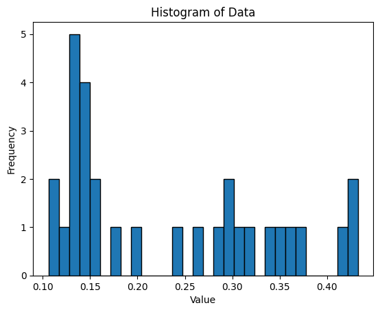

# importing libraes


```python
import pandas as pd 
import os 
import numpy as np
```


```python
import os

# Diretório que você deseja listar
diretorio = "C:/Users/vitor.yuichi/Desktop/Pasta Vitor/Univ/samplesExtractValuesFromRaster/IDW"

# Lista os arquivos no diretório
arquivos = os.listdir(diretorio)

arquivos

```


    ['testing0_training0_IDW_tif_extracted_values.csv',
     'testing10_training10_IDW_tif_extracted_values.csv',
     'testing11_training11_IDW_tif_extracted_values.csv',
     'testing12_training12_IDW_tif_extracted_values.csv',
     'testing13_training13_IDW_tif_extracted_values.csv',
     'testing14_training14_IDW_tif_extracted_values.csv',
     'testing15_training15_IDW_tif_extracted_values.csv',
     'testing16_training16_IDW_tif_extracted_values.csv',
     'testing17_training17_IDW_tif_extracted_values.csv',
     'testing18_training18_IDW_tif_extracted_values.csv',
     'testing19_training19_IDW_tif_extracted_values.csv',
     'testing1_training1_IDW_tif_extracted_values.csv',
     'testing20_training20_IDW_tif_extracted_values.csv',
     'testing21_training21_IDW_tif_extracted_values.csv',
     'testing22_training22_IDW_tif_extracted_values.csv',
     'testing23_training23_IDW_tif_extracted_values.csv',
     'testing24_training24_IDW_tif_extracted_values.csv',
     'testing25_training25_IDW_tif_extracted_values.csv',
     'testing26_training26_IDW_tif_extracted_values.csv',
     'testing27_training27_IDW_tif_extracted_values.csv',
     'testing28_training28_IDW_tif_extracted_values.csv',
     'testing29_training29_IDW_tif_extracted_values.csv',
     'testing2_training2_IDW_tif_extracted_values.csv',
     'testing3_training3_IDW_tif_extracted_values.csv',
     'testing4_training4_IDW_tif_extracted_values.csv',
     'testing5_training5_IDW_tif_extracted_values.csv',
     'testing6_training6_IDW_tif_extracted_values.csv',
     'testing7_training7_IDW_tif_extracted_values.csv',
     'testing8_training8_IDW_tif_extracted_values.csv',
     'testing9_training9_IDW_tif_extracted_values.csv']


```python
dfs = []
for file in arquivos:
    dfs.append(pd.read_csv(r'C:/Users/vitor.yuichi/Desktop/Pasta Vitor/Univ/samplesExtractValuesFromRaster/IDW' + '/'+ file, decimal=',', sep=';'))
```


```python
abs(dfs[0]['pluvio_tri'] - dfs[0]['RASTERVALU'])
```


    0      530.220007
    1      114.561011
    2    11078.600000
    3       66.989990
    4      110.844971
    5        5.893994
    6      480.762988
    7    10947.800000
    dtype: float64


```python
for k in range(0, len(dfs)):
    dfs[k]['absDifferenceValue'] = abs(dfs[k]['pluvio_tri'] - dfs[k]['RASTERVALU'])
```


```python
for k in range(0, len(dfs)):
    dfs[k]['absDifferenceValueRelative'] = abs((dfs[k]['pluvio_tri'] - dfs[k]['RASTERVALU'])/dfs[k]['pluvio_tri'])
```


```python
import numpy as np

```


```python
for k in range(0, len(dfs)):
    dfs[k]=dfs[k][dfs[k]['absDifferenceValueRelative']<1.5]
```


```python
import numpy as np 
dfs_deviations = []
for i in dfs:
    dfs_deviations.append(np.average(i.absDifferenceValueRelative))
```

# Desvio Relativo Médio das 30 amostras (Histograma)


```python
import matplotlib.pyplot as plt
plt.hist(dfs_deviations, bins=30, edgecolor='black')

# Add labels and title
plt.xlabel('Value')
plt.ylabel('Frequency')
plt.title('Histogram of Data')

# Display the plot
plt.show()
```


    

    


```python

```
